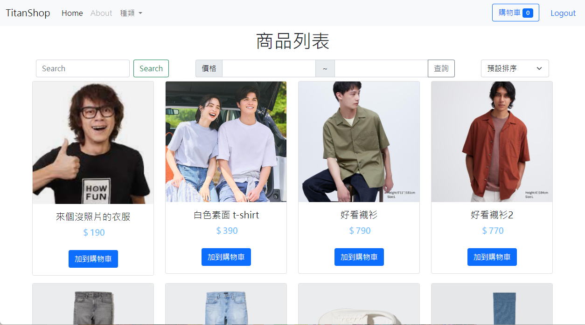
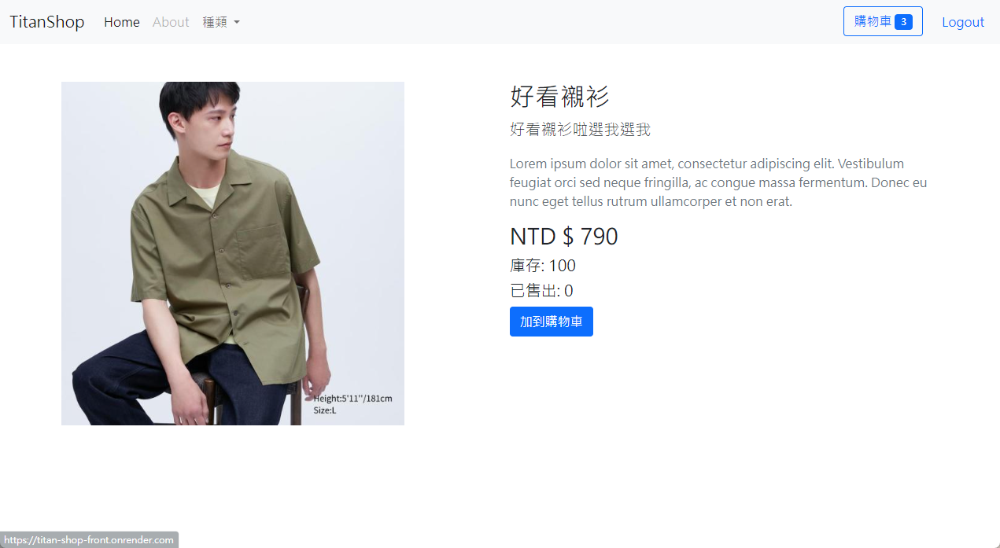
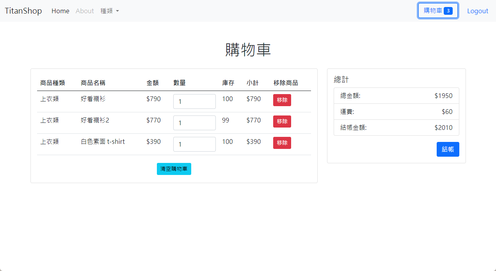
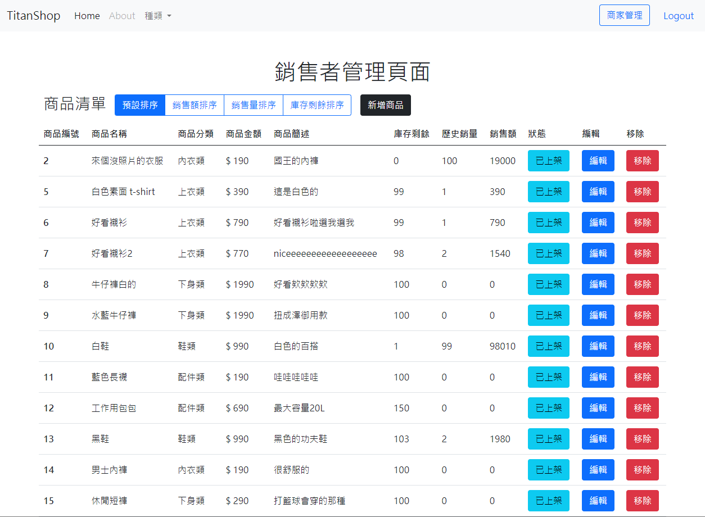

# Titan Shop Back-end

鈦坦挑戰-商店專案

---

## Project Preview

---

## About The Project

這是一個基於Vue 3、Bootstrap 5、MySQL（AWS RDS佈署） 和 Express.js的前後端分離商店專案，而您現在瀏覽的是前端部份，該專案目的為提供一個使用者友好且具備基本功能的購物網站，讓使用者可以方便地瀏覽商品、新增商品到購物車並進行結帳，而管理者則能透過管理頁瀏覽目前的銷售狀況及新增、編輯商品。

使用者
1. 前台使用者可以通過網站瀏覽各種商品，並且可以根據商品種類、價格範圍等進行篩選及排序。
2. 每個商品頁面都有詳細的描述、價格和庫存訊息，讓使用者可以快了解商品。
3. 使用者可以選擇將商品加入購物車，並隨時查看購物車內的商品數量和總金額。
4. 使用者可以在購物清單中對商品數量進行調整，並在同個頁面中送出訂單。

管理者
1. 管理者可以在網站主頁下架商品。
2. 管理頁面可以進行銷售額、銷售量、庫存數量的排序。
3. 頁面中也能新增及編輯商品，或調整上、下架及移除商品。

為了實現這些功能，前端部分使用了Vue 3作為主要框架，Bootstrap 5用於設計元件和排版，使網站在不同設備上都能具有良好的響應式設計。
後端部分使用了Express.js作為 Web API 框架，處理來自前端的請求並與MySQL數據庫存取資料。

資料庫中儲存了商品的詳細資訊，包含名稱、價格、種類、庫存、總銷售量等。當使用者新增商品到購物車時，前端會將請求傳送到後端，後端會將相應的商品數量更新到資料庫中，並將最新的購物車內容返回給前端。

而登入功能讓使用者可以通過登入來保存他們的購物車內容，並查看訂單紀錄等。

總結來說，這個商店前後端分離網頁專案提供了一個完整的購物網站解決方案，讓使用者可以輕鬆地購買商品並享受愉快的購物體驗。該專案整合了多種技術和框架，是一個值得學習和參考的項目。

[API文件](https://chingsan.notion.site/API-4a1c0b5ab0a246418ea21473ea901714?pvs=4)

### Built with

- Express.js
- MySQL (Deploy on AWS RDS)
- Sequelize CLI
- Passport
- JsonWebToken
- Imgur API

### Deploy with

- Render
- AWS-RDS

---
## Getting Started

### Prerequisites

請先確認本機已安裝 Node.js 18.16.0 與 npm 9.6.7 版本，及 [MySQL workbench](https://www.mysql.com/)

### Installation

1. 將專案 clone 至本地: 

   `git clone https://github.com/Chingsan0722/titan-shop-backend`

2. 在 git bash 或 PowerShell 中移動到該資料夾並載入組件:

   `cd titan-shop-backend`  
   `npm install`

3. 在 ./config/config.json 中對開發環境的資料庫進行設定，使用 MySQL workbench 建立新的 Schema 

4. 逐行載入初始化資料庫與種子資料

   `npx sequelize db:migrate`  
   `npx sequelize db:seed:all`

   （若中途發生錯誤，請檢查是否成功連接至本地資料庫）

5. 更新環境變數 .env

   修改資料夾根目錄中的 `.env.example` 為 `.env` ，並將環境變數寫入：

   PORT = `預設為3000`  
   JWT_SECRET = `自定義英文字串`  
   IMGUR_CLIENT_ID = [到 Imgur.com 建立一個應用程式並取得 clientID](https://imgur.com/account/settings/apps)  
   AWS_DB_URI = `本地測試環境可忽略`  

6. 在本地中運行程式

    `npm run dev`

7. 在瀏覽器中載入網址 

   http://localhost:PORT/

8. 若未與前端對接可使用 [Postman](https://www.postman.com/) 進行 API 請求測試

   請注意：此為前後分離的專案，若要與前端伺服器連線須先同步將前端專案 clone 至本地，並啟動運作，再到前端路徑： `./src/api/axiosInstance.js` 將網址變更為後端伺服器網址

## Website 

[Render page](https://titan-shop-front.onrender.com/)

開啟後若無內容，可能須等待後端 server 啟動，約需時 1 分鐘。

## Frontend Link

[Repo](https://github.com/Chingsan0722/titan-shop-frontend)

---

## Contact

[Ching Lin](rory85722@gmail.com)

---

## Acknowledgment

Front-end, Back-end: Ching Lin

---
